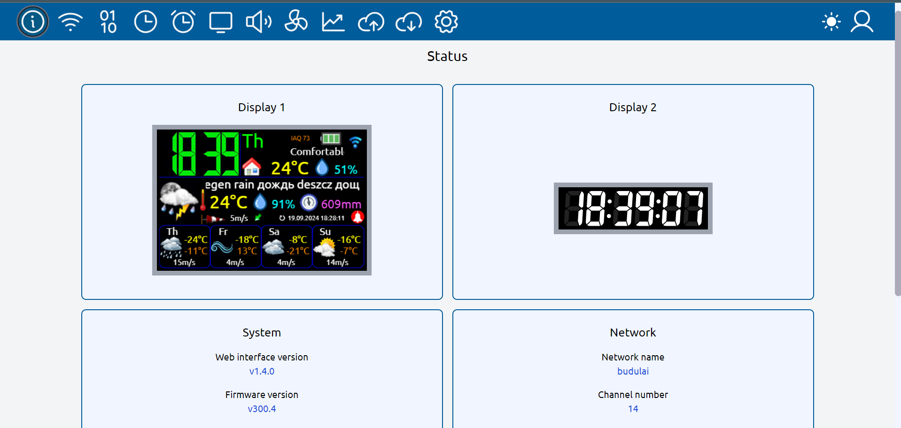
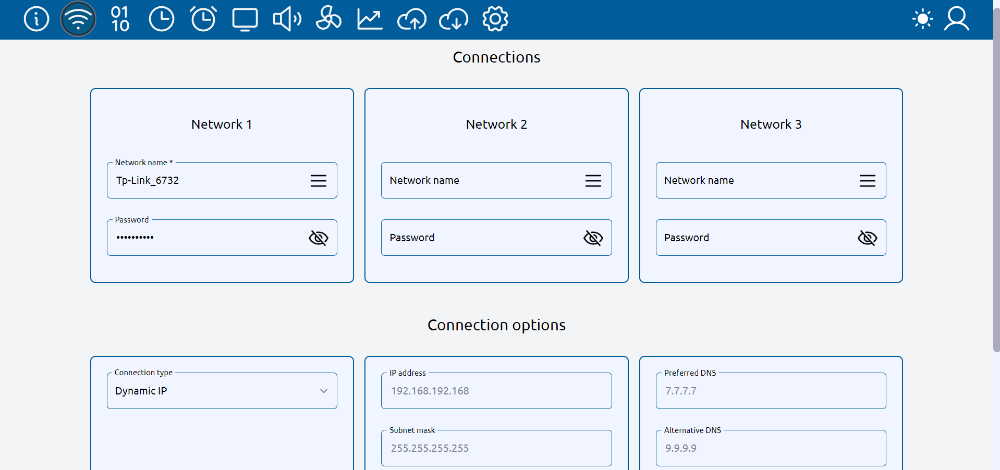
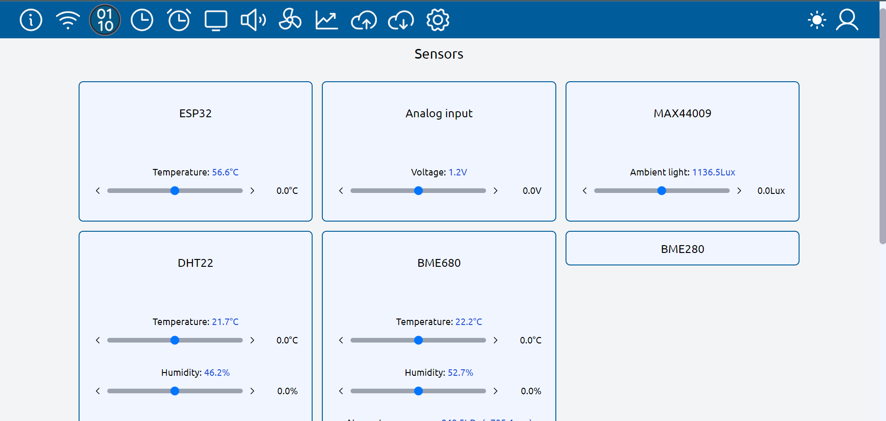
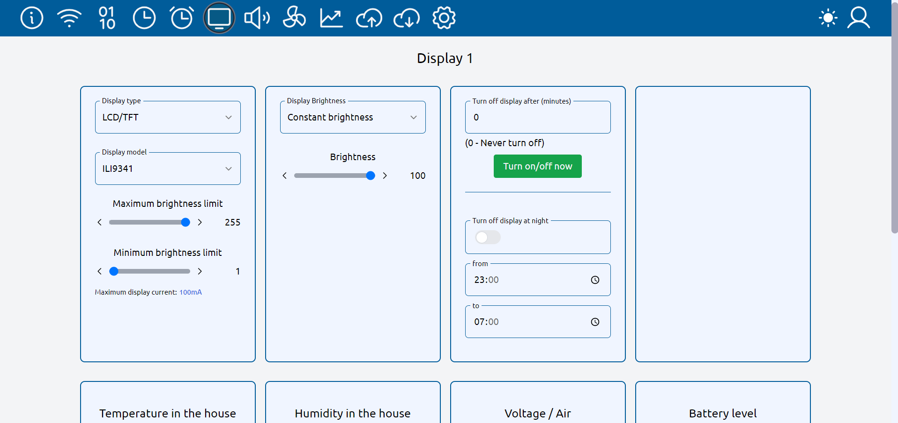
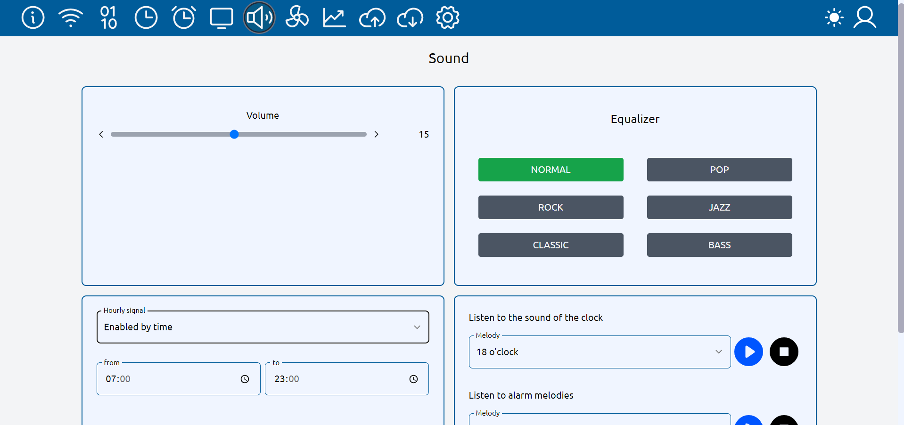
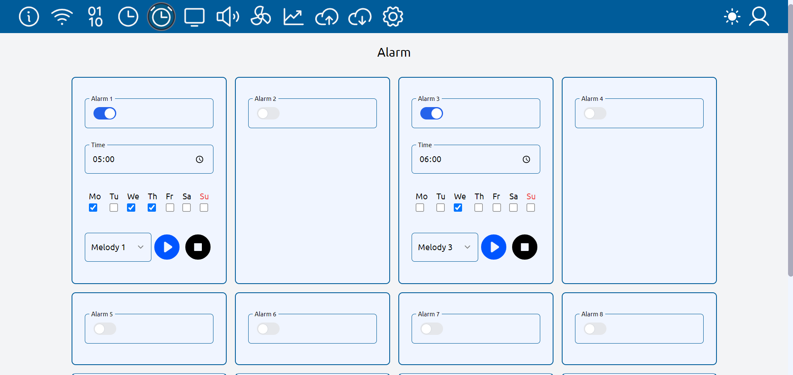
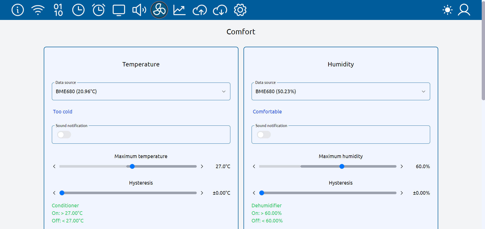

# Web interface of weather monitor settings

This web interface is designed to work together with the weather monitor https://github.com/himikat123/Weather-monitor-BIM32

## Page live preview: https://himikat123.github.io/Web-Interface-BIM/

### some screenshots:

###
Start debugging
    `npm start`

or

Build project `npm run build` then in file **/build/index.html** move the `` tag along with its contents between tags `</body>` and `</html>`

and then run `gulp`

## Public to gihub-pages
`npm run deploy`